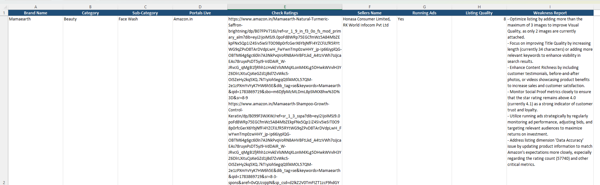

# E-Commerce Brand Intelligence Agent

**Candidate:** Swedeshna Mishra

An autonomous CLI agent that, given a brand name, scrapes Amazon.in, audits the
top listing's quality with a locally-run LLM, and writes the results to
`output.xlsx` (append-only) and `<brand_name>.md`.

---

## Setup

### 1. Install uv (free package manager)

```bash
curl -LsSf https://astral.sh/uv/install.sh | sh
```
 Windows: 
```bash
powershell -ExecutionPolicy ByPass -c "irm https://astral.sh/uv/install.ps1 | iex"
```


### 2. Install Ollama (free, runs LLMs locally, no API key/cost)

```bash
https://ollama.com/download
```

### 3. Pull the free local models used by this project

```bash
ollama pull llama3.2   # text model — weakness report synthesis + listing quality scoring
ollama pull llava       # vision model — was tested for image audit; see Limitations below
```

### 4. Install project dependencies

```bash
uv sync
uv run playwright install chromium
```

### 5. Configure environment (no real secrets needed — all defaults are free/local)

```bash
cp .env.example .env
```

### 6. Run

```bash
uv run main.py "Mamaearth"
```

---

## Project Structure

```
brand-intel-agent/
├── main.py                        # Orchestrator — wires all 5 stages together
├── config.py                      # Environment/config loader
├── schemas.py                     # Pydantic models — structured data contracts
├── pyproject.toml                 # Dependencies (uv)
├── .env.example                   # Config template, no secrets
├── agents/
│   ├── discovery_agent.py         # Stage 1: brand discovery + category
│   ├── url_extractor.py           # Stage 2: real product URL extraction
│   ├── marketplace_agent.py       # Stage 3: ratings, sellers, ads
│   ├── listing_quality_agent.py   # Stage 4: 5-dimension quality audit
│   └── weakness_agent.py          # Stage 5: weakness report synthesis
├── outputs/
│   ├── excel_writer.py            # Append-only styled Excel output
│   └── markdown_writer.py         # Markdown report generator
├── utils/
│   ├── browser.py                 # Playwright wrapper, retries, delays
│   └── logger.py                  # Timestamped console logging
├── output.xlsx                    # Generated — one row per brand
└── <brand_name>.md                # Generated — one report per brand
```

---

## Architecture / Tools Used

| Stage | Module | Approach |
|---|---|---|
| Discovery | `agents/discovery_agent.py` | Playwright loads Amazon.in search results, confirms presence |
| Category detection | `main.py` + `marketplace_agent.py` | Reads the breadcrumb trail (e.g. "Beauty › Face Wash") from the top product page — more reliable than the search page's department filter, which Amazon frequently hides or A/B-tests |
| URL extraction | `agents/url_extractor.py` | Parses real product links from search cards (`a:has(h2)`), dedupes, ranks by rating count; resolves sponsored `/sspa/click` redirects to their final canonical URL when visited |
| Marketplace data | `agents/marketplace_agent.py` | Visits each product page, extracts rating count, seller, star rating, images, bullets, description, breadcrumb |
| Listing quality | `agents/listing_quality_agent.py` | Sends title/bullets/description to a local Ollama model (`llama3.2`) for per-dimension GOOD/MODERATE/BAD verdicts, then **computes the final 1–10 score deterministically in Python** using fixed dimension weights (`_compute_weighted_score`) rather than trusting the LLM's own arithmetic |
| Weakness synthesis | `agents/weakness_agent.py` | Feeds all structured data to the local LLM for 4–6 evidence-cited bullets; falls back to a rule-based summary if Ollama is unavailable or slow |
| Excel output | `outputs/excel_writer.py` | `openpyxl`, append-only, styled header row (dark blue fill, white bold text), wrapped cell text |
| Markdown output | `outputs/markdown_writer.py` | Structured Markdown with tables for marketplace data and quality dimensions |

**Why these choices:**
- **Ollama (local, free LLM)** instead of a paid API — runs `llama3.2` (2GB) entirely on-device, no API key, no per-token cost, no external dependency at inference time.
- **Playwright** over `requests`/BeautifulSoup because Amazon is JS-rendered and needs real browser interaction.
- **Pydantic schemas** (`schemas.py`) enforce "no free-form text in structured fields" — every stage returns a typed object, never a raw dict.
- **Deterministic score computation** — the listing-quality score is recalculated in code from the LLM's dimension verdicts using fixed weights (Title 15%, Visual 20%, Content 25%, Data Accuracy 20%, Social Proof 20%), so it's auditable and reproducible rather than dependent on the LLM's self-reported math.

---

## Known Limitations / Trade-offs

- **Vision-based image audit (`llava`) was implemented but disabled by default** — on CPU-only hardware it consistently timed out even at 300 seconds. The code path still exists (`_fetch_images_as_b64` in `listing_quality_agent.py`) and can be re-enabled by swapping the model back to `config.OLLAMA_VISION_MODEL` for machines with a GPU or more compute; currently the Visual Quality dimension is assessed from the *number* of images found and text context only, not by literally viewing them.
- **Amazon bot detection is an ongoing risk.** Amazon can serve CAPTCHAs or rate-limit repeated requests. This implementation uses a realistic user-agent and delays; for sustained production use, route through a residential proxy or scraping API via `SCRAPER_PROXY_URL` in `.env`.
- **Selectors are tuned against Amazon.in's layout as of this submission** and may drift — Amazon changes DOM structure periodically without notice.
- **Other portals (Flipkart, Nykaa, quick-commerce) are not implemented** — only Amazon.in, per the spec's core functional requirements. The weakness report notes the brand's absence elsewhere without actually scraping those sites.
- **LLM non-determinism** in the weakness bullets and dimension verdicts (though the final numeric score is now deterministic, see above) — running the same brand twice may produce slightly different but equally valid wording.
- **No automated test suite** given the time constraints — recommend `pytest` coverage of the parsing helpers (`_parse_rating_count`, `_parse_int`, `_compute_weighted_score`) and mocked Playwright pages before productionizing.

---

## Sample Output

======================================================================
- LEAD GEN AGENT | Brand: Mamaearth
- Started: 2026-07-12 21:38:06
- [21:38:32] discovery_agent -> found on Amazon | category: unknown, sub_category: unknown
- [21:38:45] url_extractor -> 5 amazon product URLs found
- [21:39:07] marketplace_agent -> 2 sellers, running_ads: True
- [21:39:08] discovery_agent -> category refined from product breadcrumb: Beauty -> Face Wash
- [21:40:53] listing_quality -> score: 7/10 (weighted from 5 dimensions)
- [21:42:22] weakness_agent -> 6 weakness bullets generated
- [21:42:23] excel -> saved row 5 to output.xlsx
- [21:42:23] markdown -> saved Mamaearth.md
- ✅ DONE: Mamaearth

**Resilience test** (brand that doesn't exist on Amazon):
- [21:14:40] discovery_agent -> 'Zzqqxxnonexistentbrandxyz123' not found on Amazon.in
- [21:14:40] url_extractor -> skipped, brand not found on Amazon
- [21:14:40] marketplace_agent -> skipped, brand not found on Amazon
- [21:14:40] listing_quality -> no product data available, defaulting to score 0
- [21:15:29] weakness_agent -> 6 weakness bullets generated
- [21:15:29] excel -> saved row 4 to output.xlsx
- [21:15:29] markdown -> saved Zzqqxxnonexistentbrandxyz123.md
- ✅ DONE: Zzqqxxnonexistentbrandxyz123
Confirms the pipeline degrades gracefully rather than crashing when a brand isn't found.

**Excel output:**



**Markdown report:**

.png)
.png)
